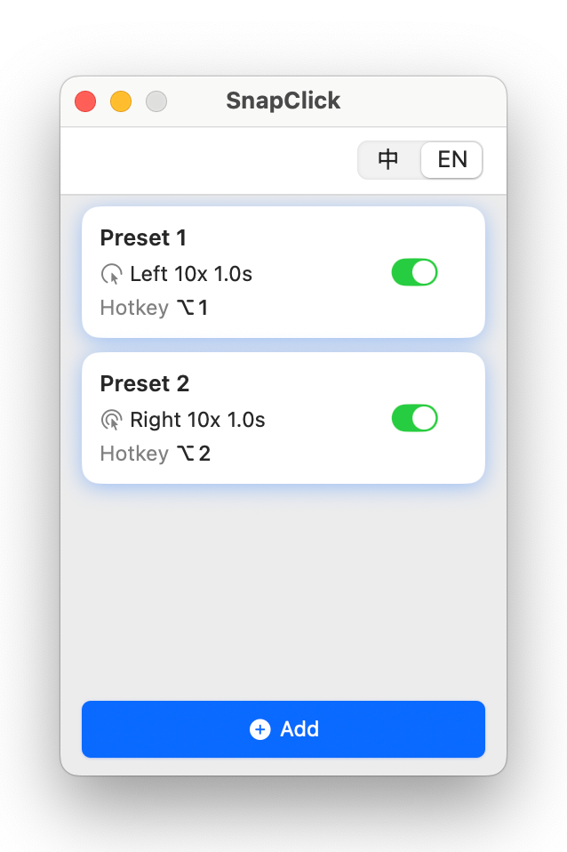

# SnapClick

<div align="center">


**The easiest and most handy auto-clicker for Mac**

[](https://www.apple.com/macos/)
[](https://support.apple.com/en-us/HT211814)
[](LICENSE)

[English](README.md) | [中文](README.zh-CN.md)

</div>

## Download
Click [**Download**](https://github.com/mmmelson/SnapClick/releases/download/v2.0/SnapClick_v2.0.dmg) to start!

SnapClick is too intuitive; you won't need any introduction.

## Why SnapClick?

I recently stumbled upon the browser version of [Command & Conquer: Red Alert 2](https://game.chronodivide.com) and discovered it runs on Mac! Triggered a wave of childhood nostalgia, I quickly found myself addicted to my first "gaming enlightenment" all over again.

However, building a tank army demands rapid, repetitive clicking - especially challenging when using just a trackpad! 😅
I tried several off-the-shelf auto-clickers, but they were either locked behind a paywall or just didn't feel right.

That's why I built SnapClick — a simple, stable auto-clicker that just works.

## Features

- 🎯 **Multiple Schemes** - Different click configs with custom hotkeys
- ⚡ **Global Hotkeys** - Trigger from anywhere
- 🖱️ **Left & Right Click** - Both buttons supported
- ⏱️ **Precise Control** - Set exact counts and duration
- 📊 **Background Running** - Works even when window is closed

<div align="center">



</div>

## FAQ

<details>
<summary><b>What are the system requirements?</b></summary>

- **macOS**: 13.0 (Ventura) or later
- **CPU**: Apple Silicon (M1/M2/M3/M4)
- **Permissions**: Accessibility access (required for global hotkeys and mouse control)

</details>

<details>
<summary><b>Can't open the app?</b></summary>

Right-click the app → "Open" → "Open" (required once for unsigned apps)

**Or use Terminal**:
```bash
xattr -cr /Applications/SnapClick.app
open /Applications/SnapClick.app
```

</details>

<details>
<summary><b>How do I grant Accessibility permission?</b></summary>

Go to **System Settings** → **Privacy & Security** → **Accessibility** → Enable SnapClick

If already enabled but not working, try toggling it OFF then ON again.

</details>

<details>
<summary><b>What's the CPS limit?</b></summary>

⚠️ **Maximum: 200 CPS** (Clicks Per Second)

Higher speeds can crash macOS. The app prevents unsafe configurations.

**Formula**: `CPS = Clicks ÷ Duration`

**Examples**:
- ✅ 100 clicks in 1 sec = 100 CPS (Safe)
- ❌ 100 clicks in 0.3 sec = 333 CPS (Blocked)

</details>

<details>
<summary><b>Hotkeys not working?</b></summary>

1. Check Accessibility permission is granted
2. Verify scheme is enabled (green ✅)
3. Check for conflicting shortcuts
4. Restart the app

</details>

<details>
<summary><b>Intel Mac support?</b></summary>

Currently Apple Silicon only. Build from source to customize target architecture.

</details>

<details>
<summary><b>How to build from source?</b></summary>

```bash
git clone https://github.com/mmmelson/SnapClick.git
cd SnapClick
./Scripts/build_app.sh
```

</details>

## License

MIT License - see [LICENSE](LICENSE)

---

<div align="center">

**Enjoy using SnapClick! 🎉**

If you find it useful, please give it a ⭐️ Star

[Report Issue](https://github.com/mmmelson/SnapClick/issues) · [Request Feature](https://github.com/mmmelson/SnapClick/discussions)

</div>
