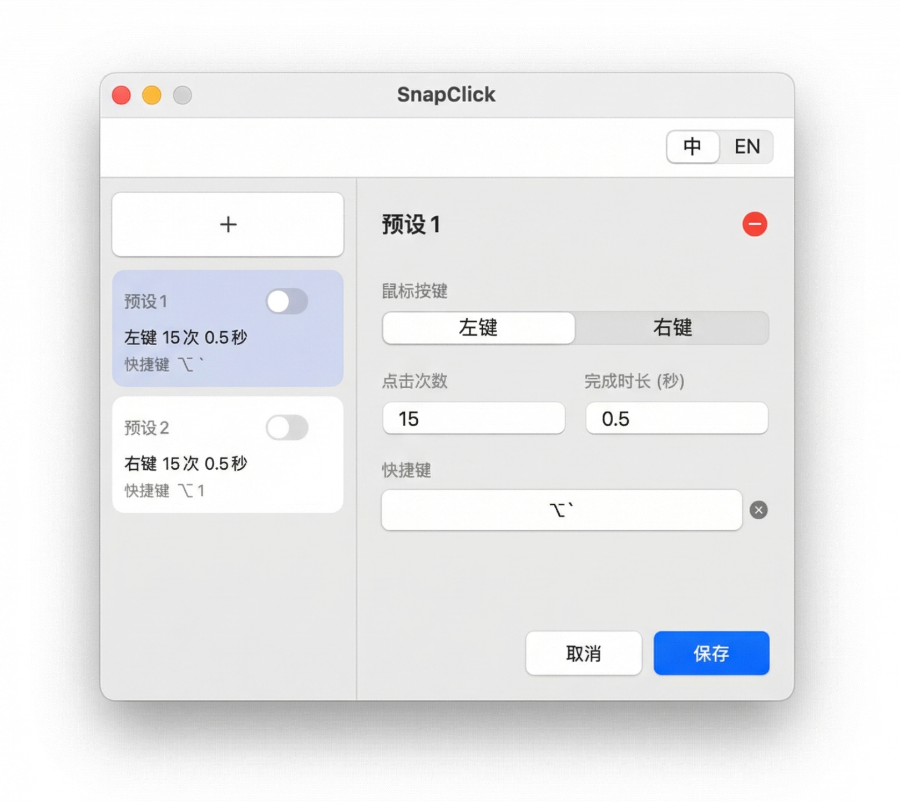
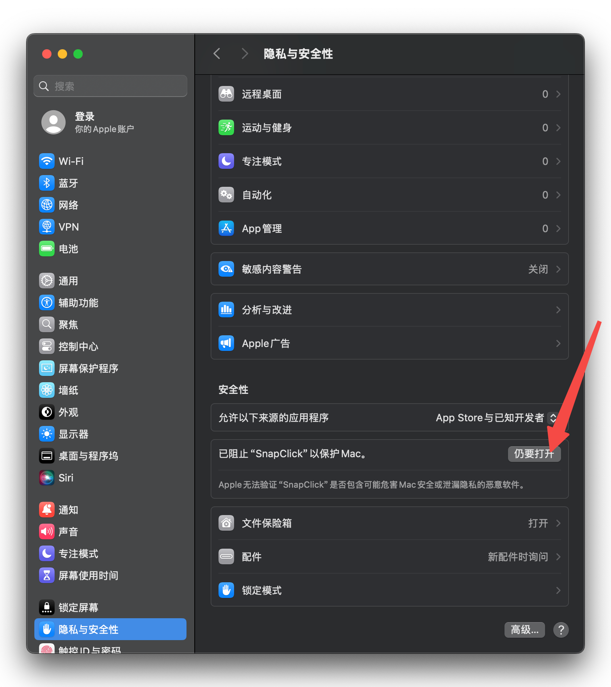

# SnapClick

<div align="center">


🖱️ **Mac上最简单易用的鼠标连点器**

[](https://www.apple.com/macos/)
[](https://support.apple.com/en-us/HT211814)
[](LICENSE)

[English](README.md) | [中文](README.zh-CN.md)

</div>

## 下载
点击[**下载**](https://github.com/mmmelson/SnapClick/releases/download/v3.0/SnapClick_v3.0.dmg)，即可开始！

SnapClick太直观了，你不会需要任何介绍。

## 为什么做 SnapClick？

最近偶然间惊喜地发现了网页版的《红色警戒2》，在Mac端也能玩，于是和童年记忆狠狠地链接了一波，很快就重新沉迷上这款当年的启蒙游戏。
然而，组建一个坦克大军、快速重复点击同一个单位无数次，对于我这个只用触控板的玩家来说简直酸爽！😅

我开始尝试市面上现成的一些连点器工具，但他们要么需要付费，要么不够好用。

这就是SnapClick的由来，一个简单、稳定、够用的mac端鼠标连点器。

<div align="center">



</div>

## ✨ 特性

- 🎯 **多方案管理** - 不同点击配置，自定义快捷键
- ⚡ **全局快捷键** - 任何地方触发
- 🖱️ **左右键支持** - 两个按键都支持
- ⏱️ **精确控制** - 准确设置次数和时长
- 📊 **后台运行** - 窗口关闭也能工作

## ❓ 常见问题

<details>
<summary><b>系统要求是什么？</b></summary>

- **操作系统**: macOS 13.0 (Ventura) 或更高
- **处理器**: Apple Silicon (M1/M2/M3/M4)
- **权限**: 辅助功能权限（用于全局快捷键和鼠标控制）

</details>

<details>
<summary><b>无法打开应用？</b></summary>

**macOS 会显示安全警告，因为本应用未经过公证。** 这对于没有 Apple Developer 会员资格的开源应用来说是正常现象。

**方式 1：右键打开（推荐）**

<div align="center">

</div>

右键应用 → **打开** → **打开**（未签名应用需要一次）

**方式 2：系统设置**

<div align="center">

</div>

打开 **系统设置** → **隐私与安全性** → 点击 **仍要打开**

**方式 3：终端命令**
```bash
xattr -cr /Applications/SnapClick.app
open /Applications/SnapClick.app
```

</details>

<details>
<summary><b>如何授予辅助功能权限？</b></summary>

打开 **系统设置** → **隐私与安全性** → **辅助功能** → 启用 SnapClick

如已启用但不工作，尝试先关闭再重新打开。

</details>

<details>
<summary><b>CPS 限制是多少？</b></summary>

⚠️ **最大值：200 CPS**（每秒点击数）

更高速率可能导致 macOS 崩溃，应用会阻止不安全的配置。

**公式**: `CPS = 点击次数 ÷ 时长`

**示例**:
- ✅ 100 次点击 1 秒 = 100 CPS（安全）
- ❌ 100 次点击 0.3 秒 = 333 CPS（已阻止）

</details>

<details>
<summary><b>快捷键不响应？</b></summary>

1. 检查是否已授予「辅助功能」权限
2. 确认方案已启用（绿色 ✅）
3. 检查是否与其他快捷键冲突
4. 重启应用

</details>

<details>
<summary><b>支持 Intel Mac 吗？</b></summary>

当前仅支持 Apple Silicon。可从源码构建并自定义目标架构。

</details>

<details>
<summary><b>如何从源码构建？</b></summary>

```bash
git clone https://github.com/mmmelson/SnapClick.git
cd SnapClick
./Scripts/build_app.sh
```

</details>

## 📋 更新日志

### v2.0 (最新版本)
- 🐛 修复更新方案时点击次数累加的问题
- 🐛 修复快捷键触发时的应用崩溃问题
- ✨ 增强全局快捷键在所有应用中的可靠性
- 📦 添加带可视化引导的自定义 DMG 安装包

### v1.0
- 🎉 首个版本发布

## 📄 许可证

MIT 许可证 - 详见 [LICENSE](LICENSE)

---

<div align="center">

**使用愉快！ 🎉**

如果觉得有用，请给个 ⭐️ Star

[问题反馈](https://github.com/mmmelson/SnapClick/issues) · [功能建议](https://github.com/mmmelson/SnapClick/discussions)

</div>
